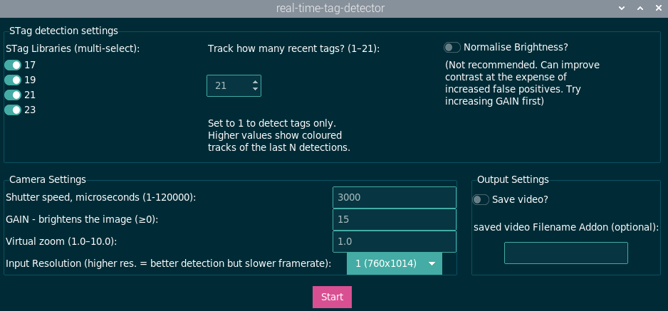

# Real-time tag detector
A lightweight Python tool for real-time detection and tracking of STag markers. It displays camera output with tag information overlaid live on the video stream. 

This **real-time STag detector** (this repository) was developed as a tool to display detected tags in real-time, allowing for a **live view of the tags** rather than having to analyze them after the recording process. 

This code keeps track of the n most recently detected tags and colour codes them. This means that even if a tag moves out of frame for a few seconds, it will still have the same colour when it returns.

  

### What are STags?
STags, designed by [Burak Benligiray](https://github.com/bbenligiray/stag), are used for motion tracking of animals.  

 ## Compatibility Notes
- [Installer](run_installer.sh) currently tested on **Raspberry Pi OS** (Linux terminal).
- Built in **Python**
- Works with **Picam2** camera system
- Uses the **STag** library by [Burak Benligiray](https://github.com/bbenligiray/stag)for marker detection

## Installation and Instructions
Instructions for first-time installation and use can be found [here](INSTRUCTIONS.txt).

### GUI
After running the installer, run the executable .sh file [(Run_Stag_Detection.sh)](Run_Stag_Detection.sh) to open the Graphical User Interface (GUI)

  

### Settings
These settings can be tweaked to improve STag detection. 
- good contrast will improve STag Detection
- STag detection is slow on high-resolution frames due to the large number of pixels to scan. Reducing Resolution and increasing Zoom can reduce the number of pixels which improves the frame-rate of the live-stream. 

Setting | Options | Description 
:-- | :- | :-
STag Libraries | Multi-select: 17, 19, 21, 23 | This refers to the ['LibaryHD'](https://github.com/manfredstoiber/stag#-configuration:~:text=can%20be%20specified%3A-,libraryHD,-%3A) or 'Type' of STags that should be detected. Only the markers of the chosen library will be detected. When more than one library is selected, detected IDs will be displayed as a combination of the library and ID number. e.g. id 115 of Library 17 will be: 17115, 
How many recent tags? | Integer (1-21) | The code keeps track of this many tags. This code keeps track of the n most recently detected tags and colour codes them. This means that even if a tag moves out of frame for a few seconds, it will still have the same colour when it returns, unless n other tags have been detected since it moved out of frame. This variable enables changing how many other tags can be detected before this one is forgotten. If this is set to 1: No tags are detected, and there will be no colour coding. 
Shutter speed (microseconds) | Integer (1-12000) | Higher exposure increases brightness (improved tag detection) but also increases blurriness of moving tags (worse tag detection!). 
GAIN | &ge;1 | Higher Gain = brighter image, more noise. 
Virtual Zoom | (1.0-10.0) |  Higher zoom = reduced number of pixels to process = faster frame rate
Input resolution | Between 760x1014 and 3040x4056 | The resolution at which you want to capture images (input_resolution * (760x1014)). Note higher input resolution = better tag detection but slower framerate. If STags take up a small part of your image, you may want to capture in higher resolution. Otherwise, lower resolution is recommended.
Save Video? | Yes/No toggle | It is possible to run the live-stream view with or without automatically saving it. 
Video Filename Addon | Text (optional) | When selecting to save the tag detections video, this will be added on to the filename of your saved video file. 
Normalise Brightness | Yes/No toggle | This increases contrast before stag-detection by normalising the pixel values between 0 and 155. Normalising can improve contrast within the image, including contrast of tags. However sometimes it can increase lead to false positive detections. Therefore, it is recommended to try tweaking GAIN first.  

---
## License

- This project is licensed under the [MIT License](LICENSE). 
- Includes components from the 'stag-python' library (MIT-licensed).
